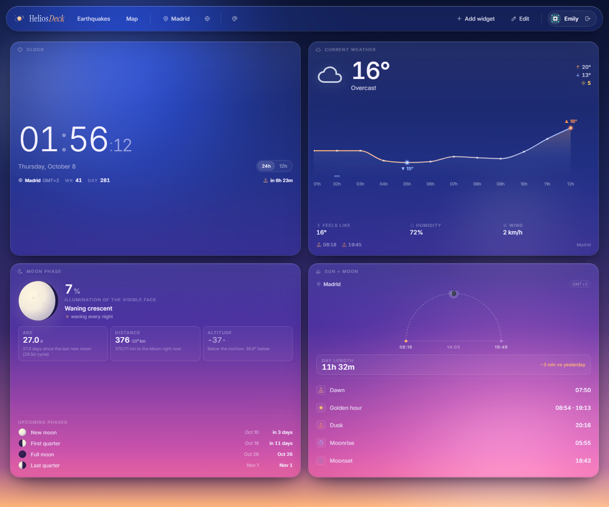
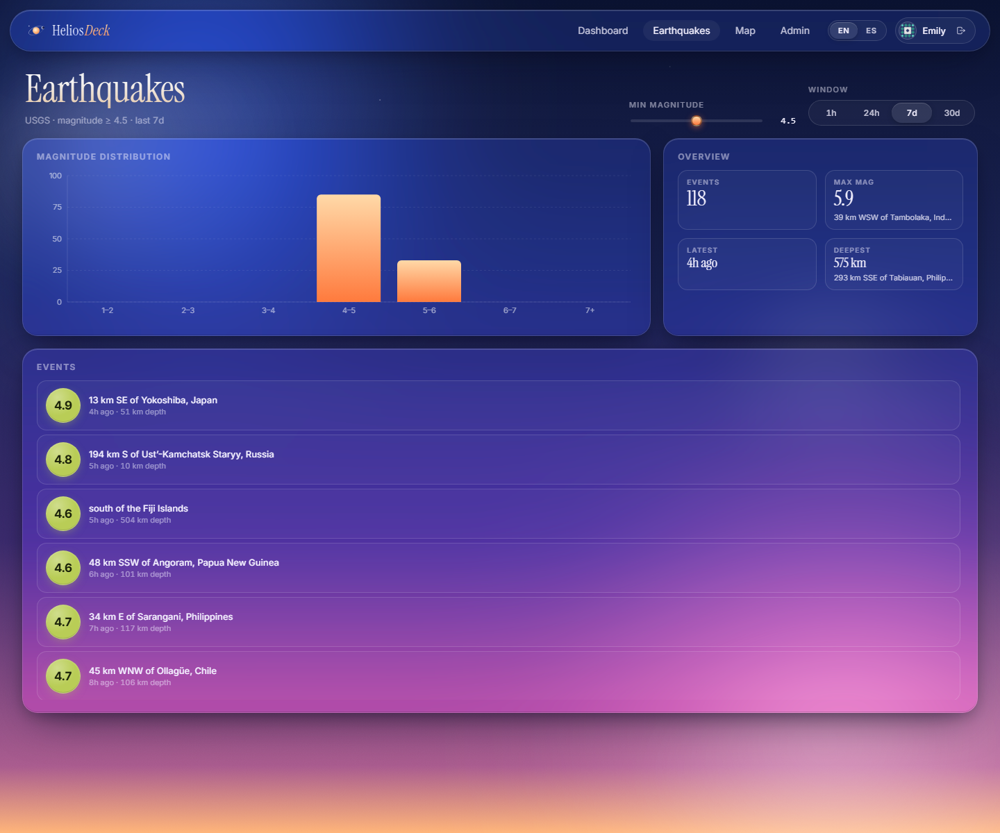
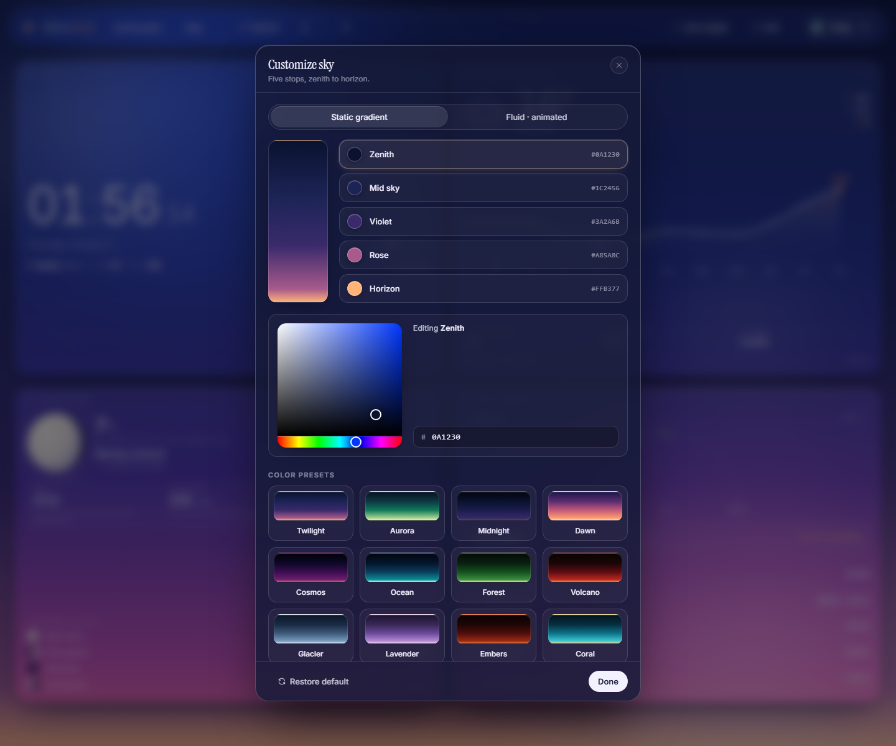

# HeliosDeck

> A geophysical aggregator dashboard. Live earthquakes, weather and sun/moon ephemerides composed as drag-and-drop widgets, with a bilingual UI and a custom-tuneable animated sky.

This is the individual final project for the React module of the **Web Atelier** course (UDIT, course 2025-2026). Spec: [Geophysical Aggregator project](https://ruvebal.github.io/web-atelier-udit/lessons/en/react/geophysical-aggregator-project/).

## Preview



<table>
  <tr>
    <td width="50%"><a href="docs/screenshots/earthquakes.png"></a><br /><strong>Earthquake explorer</strong><br />Filter live USGS events by magnitude and time window.</td>
    <td width="50%"><a href="docs/screenshots/sky-settings.png"></a><br /><strong>Sky customization</strong><br />Adjust the dashboard background with colors and presets.</td>
  </tr>
</table>

Captured from the [live demo](https://helios-deck.vercel.app/) using its public demo account. Weather and earthquake readings reflect the capture time; the widget layout is customizable.

## Track

- [x] **Track A — Declarative SPA** (`BrowserRouter`, JWT in `localStorage`, React Query as the single data layer, client-side i18n)
- [ ] Track B — Framework Mode SSR

## Live demo

- **URL:** <https://helios-deck.vercel.app>
- **Demo credentials:** click the **"Continue as demo user (emilys)"** button on the login screen — it logs you in programmatically against dummyjson without typing the credentials (so Chrome's compromised-password warning never fires).
  - Behind the scenes: username `emilys` / password `emilyspass` (public dummyjson account).
- All app routes (`/{locale}/dashboard`, `/{locale}/earthquakes`, `/{locale}/map`) are protected and require login. Visiting `/` redirects to `/en`.

## APIs used

| API | Endpoint | Data type | Refresh strategy |
|---|---|---|---|
| **dummyjson Auth** | `https://dummyjson.com/auth/{login,me,refresh}` | `{ accessToken, refreshToken, user }` | Token validated on app boot via `/auth/me`; auto-refresh via `/auth/refresh` if access token has expired |
| **USGS Earthquake Hazards (FDSN)** | `https://earthquake.usgs.gov/fdsnws/event/1/query` | GeoJSON `FeatureCollection` (point events with magnitude, place, time, depth) | React Query (`useEarthquakes`) — `staleTime`: 5 min, `refetchInterval`: 5 min, cache key parameterised by `{ minMagnitude, hoursWindow }` |
| **Open-Meteo Forecast** | `https://api.open-meteo.com/v1/forecast` | Current conditions + hourly + daily forecast | React Query (`useWeather`) — `staleTime`: 10 min, `refetchInterval`: 10 min, cache key parameterised by `{ lat, lon }` |
| Open-Meteo Geocoding *(supporting)* | `https://geocoding-api.open-meteo.com/v1/search` | City lookup (used by the location picker) | One-shot debounced fetch (250 ms) — not graded as a primary API |

The two **graded geophysical APIs** (rubric criterion: 2 distinct domains) are USGS (seismology) and Open-Meteo (meteorology). The cross-domain presentation lives on the `/map` page: clicking an earthquake marker opens a popup that lazily fetches the current weather at the exact epicentre.

## Features

### Authentication
- **JWT auth against dummyjson** with `accessToken` + `refreshToken` persisted in `localStorage`.
- **Boot-time validation**: every cold-start hits `/auth/me`; on 401 falls back to `/auth/refresh` before declaring the session dead.
- **Demo button** that bypasses Chrome's compromised-password warning by calling the login mutation programmatically (no value ever enters a `<input type="password">`).
- **`<ProtectedRoute>`** wrapping `/dashboard`, `/earthquakes`, `/map`. Preserves `state.from` so post-login redirects back to the originally requested page.
- **`<UserMenu>`** with avatar + first name + logout button, present in both the NavBar (Home/Login screens) and the Toolbar (Dashboard).

### Routing & i18n
- **React Router v7** declarative mode with locale segment: every route lives under `/:locale/*` (`en` and `es`).
- **Bilingual UI** — comprehensive `en.json` + `es.json` covering nav, auth, pages, widgets, modals, weather codes (21 conditions), UV levels, lunar phases (8 names), relative time formats. **Zero Spanish leftovers in EN; zero English leftovers in ES.**
- **Animated language switcher** in the NavBar (sliding pill indicator). Switches in-place without a full page reload.
- **Locale-aware integrations**: Open-Meteo geocoding fetches city names in the active language; `Intl.DateTimeFormat` calls thread the locale through `src/lib/time.js`.
- **Unmatched paths** redirect to `/en`.

### Geophysical data (two APIs, React Query)
- **`useEarthquakes`** hook — `useQuery` with parameterised cache key `['earthquakes', { minMagnitude, hoursWindow }]`, `staleTime` and `refetchInterval` of 5 minutes.
- **`useWeather`** hook — `useQuery` with cache key `['weather', { lat, lon }]`, 10-minute polling. Disabled until coordinates are available (`enabled` flag).
- **Shared cache** between the dashboard Weather widget and the map popup: clicking a marker for a city the user has already loaded weather for is instant (zero network calls).

### Earthquakes page (`/{locale}/earthquakes`)
- **Filters**: magnitude slider (1–8 in 0.5 steps) + 4 time-window tabs (1h / 24h / 7d / 30d) with a CSS-driven sliding pill indicator.
- **Magnitude histogram** (Recharts) — 7 magnitude buckets with custom amber gradient bars and a glass tooltip.
- **2×2 stats grid** — Total events, Max magnitude (with location), Latest event (relative time), Deepest event (with location).
- **Scrollable event list** with circular magnitude badges (3D-ball look — radial highlight, color-tinted glow, severity tier color), relative time + depth meta, and clickable place names that link to the official USGS event page.
- **Live "refreshing…"** indicator when `useQuery` polls.
- Loading/error/empty states styled as glass cards.

### Map page (`/{locale}/map`)
- **Dark Leaflet map** (CartoDB Dark Matter tiles).
- **Earthquake markers** (`<CircleMarker>`) — radius and color scaled per magnitude tier (mild blue → moderate yellow-green → strong orange → severe red).
- **Glass-styled popup** on each marker with the magnitude badge, place + USGS link, time + depth + coordinates with Tabler icons, and a **lazy weather card** (Open-Meteo current conditions for the epicentre — temperature, condition icon, condition label, humidity, wind).
- **Header overlay** with title + subtitle + live event counter + window tabs — same sliding pill component as the Earthquakes page.
- **Magnitude legend** glass card at bottom-left.
- **Vertical-only pan limit** (`maxBounds=[[-85, -Infinity], [85, Infinity]]` + `maxBoundsViscosity: 1.0`) so the user can't drag into the void above/below the projection, but `worldCopyJump` keeps horizontal scrolling infinite.
- **Custom zoom control** at top-right (default Leaflet position would collide with the header overlay).

### Dashboard (`/{locale}/dashboard`)
- **Drag-and-resize widget grid** (`react-grid-layout` + `dnd-kit`) with edit mode, picker modal, and reset confirmation dialog.
- **Empty hero** when no widgets are placed — illustration, CTAs to add widgets, chips listing what's available.
- **Toolbar** with: brand link to home, route shortcuts, location pill (with city search popover), GPS button, sky customization button, add-widget, edit toggle, reset (in edit mode), and the user menu.

### Widgets (4 of them)
- **Clock** — local time with seconds, weekday + day + month formatted in active locale, ISO week number, day of year, countdown to next sunrise/sunset (geolocated), 12h/24h toggle.
- **MoonPhase** — phase glyph (custom SVG with terminator), illumination percentage, named phase (8 cycle phases translated), waxing/waning indicator, age + distance + altitude stats, upcoming phases list with dates.
- **Sun + moon (SunTimes)** — interactive arc with current sun position, dawn/dusk markers, glowing sun/moon disks, day length + delta vs yesterday, list of dawn / golden hour / dusk / moonrise / moonset times.
- **Weather** — current temperature with weather icon (color-tinted by condition), min/max + UV index, hourly precipitation chart (Recharts), feels-like / humidity / wind stats, sunrise + sunset timestamps. Powered by `useWeather` (React Query).

### Sky background customization
- **12 color presets** (Twilight, Aurora, Midnight, Dawn, Cosmos, Ocean, Forest, Volcano, Glacier, Lavender, Embers, Coral) each defining 5 stops from zenith to horizon.
- **Custom color picker** powered by [`react-colorful`](https://github.com/omgovich/react-colorful) — large hue + saturation/value pad + hex input synced bidirectionally. Click a stop row to make it the active edit target.
- **Two sky modes** (sliding pill toggle):
  - **Static gradient** — the original linear gradient with two animated aurora blobs.
  - **Fluid · animated** — a WebGL mesh gradient (lazy-loaded `shadergradient` + `three.js`, ~265 KB gzipped chunk that **only** ships when the user enables this mode).
- **6 animation presets** for Fluid mode (Liquid wave / Aurora flow / Slow drift / Plasma / Mist / Storm), each tuning camera, deformation, and rotation differently.
- **5 fine-tune sliders** (Speed / Intensity / Frequency / Density / Brightness) that override the active preset's defaults; "Reset" button restores them.
- **`<SkyFluidErrorBoundary>`** falls back to the static gradient if the shader bundle ever fails (CDN flake, no GPU, etc).

### Other UX details
- **Custom glass design system** — backdrop-filter + saturated blur + design tokens, no CSS framework.
- **Sliding pill indicators** (CSS-driven via `--idx` custom property) reused in 4 places: Earthquakes window tabs, Map window tabs, Sky mode toggle, Language switcher.
- **City search** with debounced Open-Meteo geocoding, keyboard navigation (↑/↓/Enter/Escape), country flags rendered as emoji from ISO 3166 codes.
- **Persistent settings** via Zustand + persist middleware (key `helios-deck/settings`) — location, gradient stops, sky mode, fluid preset, fine-tune sliders all survive reload.
- **Persistent dashboard layout** — widgets and their grid positions stored in their own Zustand slice.

### Code quality
- **Service layer** isolated in `src/services/` and `src/lib/api/`.
- **Hooks layer** in `src/hooks/` (one file per query / utility).
- **Inline `@ai-assisted` JSDoc comments** on every non-trivial AI-assisted unit (`grep -rn "@ai-assisted" src/`).
- **No `useEffect` + `fetch`** in components — every API call goes through React Query.
- **Bundle code-split** so static-mode users never download the WebGL bundle.

## Tech stack

- **React 18** + **Vite 5**
- **React Router v7** — declarative mode (`BrowserRouter`)
- **TanStack React Query v5** — single data layer for both APIs
- **Zustand** + persist middleware — settings (location, sky palette, fluid mode) and dashboard state (widgets, layout)
- **Recharts** — magnitude histogram on the Earthquakes page
- **react-leaflet 4** + **Leaflet** — earthquake/weather map (dark CartoDB tiles)
- **react-colorful** — custom color picker inside the sky modal
- **shadergradient + three.js** (lazy-loaded) — WebGL mesh gradient for the optional Fluid sky mode
- **dnd-kit** + **react-grid-layout** — widget drag/resize
- **suncalc** — sun and moon ephemerides
- **Tabler Icons** — icon system
- Custom CSS with design tokens (no CSS framework)
- Deployed on **Vercel** (auto-detected Vite project, SPA fallback handled natively)

## Architecture notes

- All data fetching lives in `src/hooks/{useEarthquakes,useWeather}.js` as `useQuery` hooks with parameterised cache keys; no `useEffect`+`fetch` in components. The legacy `WeatherWidget` was migrated from a custom `usePolling` hook to React Query so the map popup can share the same cache as the dashboard widget.
- Authentication is a JWT-based `AuthContext` (`src/contexts/AuthContext.jsx`) that reads/writes `helios.auth` in `localStorage`. On boot it validates the access token via `/auth/me`; on 401 it falls back to `/auth/refresh` before declaring the session unauthenticated. `<ProtectedRoute>` redirects to the localised `/login` and preserves `state.from` so post-login navigates back where the user wanted to go.
- The locale is encoded in the URL (`/:locale/*` segment with `en` and `es`). A `LocaleLayout` route validates the segment, mounts the `I18nProvider`, and renders `<NavBar>` + `<Outlet>`. The language switcher in the NavBar swaps the segment via `replaceLang(pathname, lang)` so a user on `/en/earthquakes?...` lands on `/es/earthquakes?...` without losing context.
- The sky background has two modes (Static gradient and Fluid · animated). Fluid mode lazy-loads `SkyFluidShader.jsx` so the WebGL bundle (`three.js` + `shadergradient`, ~265 KB gzipped) is **not** in the main chunk — users who never enable Fluid mode never download it.

## Known limitations

- React Query polling intervals are fixed (5 min for earthquakes, 10 min for weather). No live "manual refresh" button on most surfaces — you can change a filter to force a refetch.
- USGS results are capped at `limit=500` per query. With `1h` window + `M ≥ 1` you might hit it during high seismic activity; the page does not paginate.
- The earthquake/weather map renders one earthquake popup at a time; clicking between markers re-fetches weather but it's cached for 10 min by React Query so only the first click of each location does a real network call.
- Token refresh runs only on app boot. A 401 mid-session forces the user to re-login (no fetch interceptor wraps subsequent calls). Acceptable trade-off for a 30-minute access token in a single-tab session.
- Locale is in the URL but not synced with the browser language preference on first visit — unmatched paths default to `/en`. Users land in English unless they manually switch (or share an `/es/...` link).
- Fluid sky requires WebGL. There is an `ErrorBoundary` that falls back to the static gradient if the shader bundle fails to mount, so the rest of the app stays usable.

## Setup

```bash
npm install
cp .env.example .env          # fill in if you need overrides — defaults work
npm run dev                   # http://localhost:5173
npm run build && npm run preview   # production build smoke-test
```

Required env vars (all optional, defaults work for the public APIs):

| Variable | Required? | Default | Purpose |
|---|---|---|---|
| `VITE_API_BASE_URL` | optional | `https://dummyjson.com` | Auth provider base URL |

## Deployment

Production build outputs to `dist/`. Any static host that supports SPA fallback (rewrite all paths to `/index.html`) works:

- **Netlify:** add a `_redirects` file with `/* /index.html 200` *or* use `netlify.toml`. Build command `npm run build`, publish dir `dist`.
- **Vercel:** auto-detected as a Vite project; no extra config needed.

## AI assistance disclosure

This project was developed with assistance from **Anthropic Claude** (Claude Opus 4.7 inside the Claude Code CLI).

**AI was used for:**
- Scaffolding the `AuthContext` + `ProtectedRoute` flow, including the boot-time `/auth/me` + `/auth/refresh` fallback.
- Building the `useEarthquakes` and `useWeather` React Query hooks and refactoring the legacy `usePolling`-based weather widget to share the same query cache.
- Designing the Earthquakes page (filters, recharts histogram, scrollable list with magnitude badges, stats grid) and the Map page (CartoDB tiles, `<CircleMarker>` styling per magnitude, lazy weather popup).
- Building the bilingual i18n system (`I18nProvider`, `useTranslation`, URL-segment routing, `replaceLang`) and translating every hardcoded string across pages, widgets, and modals.
- Designing the optional Fluid sky mode using shadergradient with 6 named animation presets (Liquid wave / Aurora flow / Slow drift / Plasma / Mist / Storm) plus 5 fine-tune sliders backed by Zustand persist.
- Diagnosing a `three@0.184` vs `shadergradient@2.4` API incompatibility and pinning `three@~0.169` as the fix.
- Polishing UI: glass cards, magnitude badges with radial highlight, sliding pill indicators on tab groups, custom color picker via `react-colorful`, popup re-skin for Leaflet.

**Human verification (the author):**
- All code has been read, understood, and tested manually in Chrome and Firefox.
- Auth flow was verified end-to-end against the dummyjson docs: bad credentials → inline error; correct → token persisted; refresh after browser reload; logout clears storage; protected route redirects with `state.from`.
- Both EN and ES locales were walked through every page, widget, modal, and tooltip to confirm no Spanish leftovers exist in EN mode (and vice versa).
- The author takes full responsibility for the final implementation.

**Docs-first artefacts:** see [`docs/plans/`](./docs/plans/) (one plan per non-trivial feature) and [`docs/reports/`](./docs/reports/) (post-session implementation reports).

**Inline disclosure:** non-trivial AI-assisted code is flagged with `@ai-assisted` JSDoc comments — grep the codebase for `@ai-assisted` to find them.

---

## Resumen en español

**HeliosDeck** es un dashboard agregador de datos geofísicos en tiempo real. Track A (SPA declarativa con React Router v7), autenticación JWT contra dummyjson, React Query como única capa de datos, dos APIs públicas (USGS para sismología, Open-Meteo para meteorología) presentadas de forma cruzada en el mapa interactivo (popup de cada terremoto muestra el clima actual en su epicentro), i18n bilingüe (EN/ES) con locale en la URL, y deploy estático.

El proyecto extiende un dashboard de widgets pre-existente (Reloj, Fase lunar, Sol y luna, Tiempo) compuestos con `dnd-kit` + `react-grid-layout`, y añade un modo de fondo "Fluid" opcional que renderiza un mesh gradient WebGL con shadergradient + three.js (lazy-loaded para no inflar el bundle principal).

Para probar: pulsa "Continue as demo user (emilys)" en `/login` — entra contra dummyjson con credenciales públicas sin disparar el aviso de password filtrado de Chrome.
